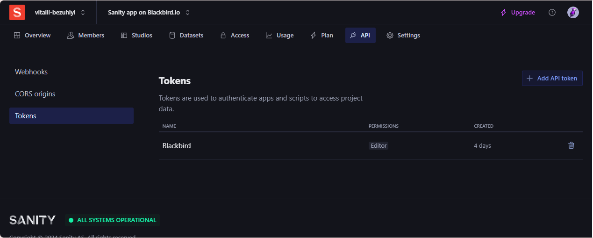
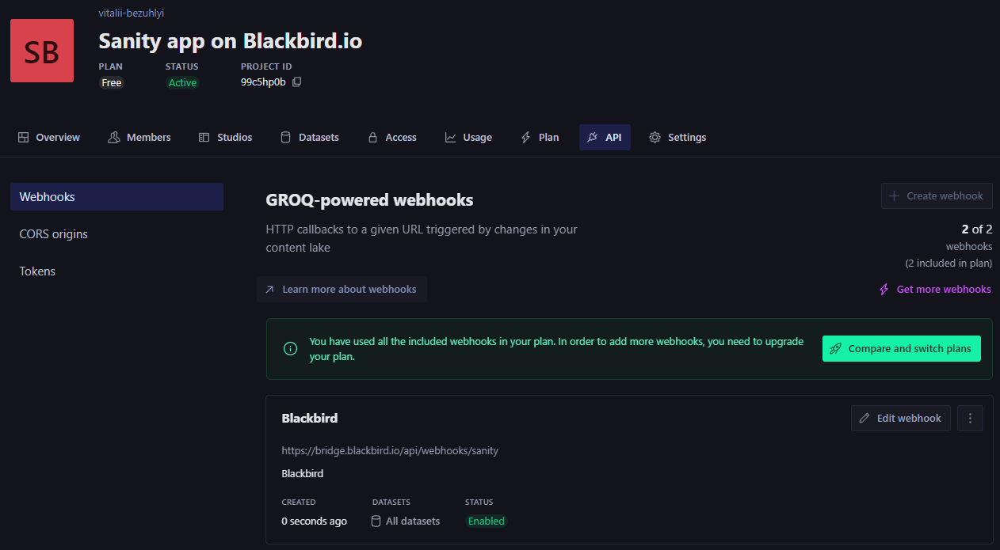

# Blackbird.io Sanity Integration

Blackbird is the new automation backbone for the language technology industry. Blackbird provides enterprise-scale automation and orchestration with a simple no-code/low-code platform. Blackbird enables ambitious organizations to identify, vet and automate as many processes as possible. Not just localization workflows, but any business and IT process. This repository represents an application that is deployable on Blackbird and usable inside the workflow editor.

## Introduction

<!-- begin docs -->

Sanity is a headless CMS (Content Management System) designed for flexibility and composability. It uses structured content, allowing businesses to reuse content across various channels. Its composable approach helps organizations connect with third-party technologies, data sources, and frontend frameworks.

## Before you set up

Before setting up the integration, ensure that you have access to a Sanity project.

1. Visit [Sanity.io](https://www.sanity.io/manage/personal) and create a new project or use an existing one.
2. Identify your **Project ID**, which can be found below your project name in the Sanity project dashboard.
3. Generate an **API token** (or use an existing one). You can generate a new token in the **API** tab of your Sanity project. The app requires **Editor** permissions to access all features. Once generated, copy the token for future use.



## Connecting to Sanity

1. Navigate to the **Apps** section and locate the **Sanity** app (you can search for it).
2. Click **Add Connection**.
3. Name your connection for future reference (e.g., 'My Organization').
4. Enter the **Project ID** in the corresponding field.
5. Enter your **API token** in the appropriate field.
6. Click **Authorize connection**.
7. Confirm that the connection is established and that the status shows **Connected**.


## Actions

- **Search content**: Search for content within a specific dataset. If no dataset is specified, the production dataset is used by default.
- **Get content**: Retrieve a content object from a specific dataset using its content identifier.
- **Get content as HTML**: Retrieve localizable content fields as an HTML file.
- **Update content from HTML**: Update localizable content fields using an HTML file.
- **Create content**: Create a content object based on its type and parameters.
- **Delete content**: Remove a content object from a dataset using its content identifier.

## HTML conversion

Please note that this app currently works with the [sanity-plugin-internationalized-array](https://github.com/sanity-io/sanity-plugin-internationalized-array). This means that the app only supports fields of the types **'internationalizedArrayStringValue'** or **'internationalizedArray'**. It will not pick up or update content with a regular string type. Only these field types are supported.

Here is an example of supported fields:

```ts
defineField({
    name: 'firstName',
    description: 'Test description',
    type: 'internationalizedArrayString',
}),
defineField({
    name: 'lastName',
    type: 'internationalizedArrayString',
}),
defineField({
    name: 'experience',
    type: 'internationalizedArrayString'
})
```

In the future, we plan to support additional localization plugins, such as the [document-internationalization plugin](https://github.com/sanity-io/document-internationalization), which works at the document level.

> If you need to translate regular content types (such as string or rich text blocks), please contact us, and we will explore a solution.

## Events

### Webhook configuration

To enable webhooks, go to your project page in Sanity.io. Select the **API** tab and click **Create new webhook**. Name the webhook (e.g., Blackbird), add a description, and enter the following URL: `https://bridge.blackbird.io/api/webhooks/sanity`. Select the document actions that will trigger the webhook (we recommend selecting all: create, update, delete). Leave the other settings at their default values. Click **Save**. You should see something like this:



### Event list

- **On content created**: Triggered when new content is created.
- **On content updated**: Triggered when existing content is updated.

> If you are using the **On content updated** event, be mindful of the potential for an infinite loop. If your workflow triggers this event and, during the action, updates the content, it could trigger the event again. To avoid this, you can use two optional filter parameters:
>
> 1. **Trigger if all language fields are not present**: When enabled, the event will only trigger if the specified "Translation language" is missing from the content.
> 2. **Translation language**: Only applies if the first filter is enabled. Set the translation language you want to target. The event will trigger only if all localization fields for that language are absent from the content.

## Limitations

- In Sanity, localization is available through a plugin, which means the user will create their own content models by writing code (including locales). Since it's a plugin, it doesn't provide any API endpoints for directly retrieving locales or other information from the plugin.

```ts
plugins: [
  structureTool(), 
  visionTool(),
  internationalizedArray({
    languages: [
      {id: 'en', title: 'English'},
      {id: 'fr', title: 'French'}
    ],
    defaultLanguages: ['en'],
    fieldTypes: ['string', 'artist']
  })
]
```

## Feedback

Do you want to use this app or do you have feedback on our implementation? Reach out to us using the [established channels](https://www.blackbird.io/) or create an issue.

<!-- end docs -->